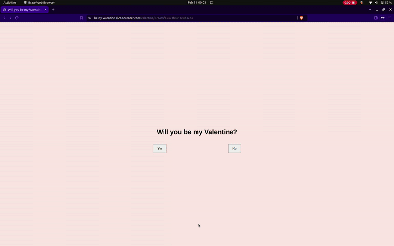

# Valentine Date Creator

A playful web app that lets you create a custom Valentine date and generate a shareable link. When your Valentine visits the link, she sees a fun "Will you be my Valentine?" page where the "No" button playfully dodges the cursor and the "Yes" button reveals your date details from a MongoDB Atlas database.




## Features

- **Create Date Details:** Enter date, time, place, and activity.
- **Shareable Link:** Get a unique URL to share.
- **Interactive Page:** "No" button dodges the cursor; "Yes" button shows the saved details.

## Tech Stack

- Node.js, Express & EJS
- MongoDB Atlas
- HTML, CSS, JavaScript

## Setup

1. **Clone the repo and install dependencies:**
   ```bash
   git clone https://github.com/your-username/valentine-app.git
   cd valentine-app
   npm install
2. **Configure MongoDB Atlas:**  
   Update the connection string in `server.js` with your MongoDB Atlas URI.
3. **Run the Server:**
   ```bash
   node server.js
   ```
4. **Access the App:**  
   Visit `http://localhost:3000/create` to create your Valentine date.

